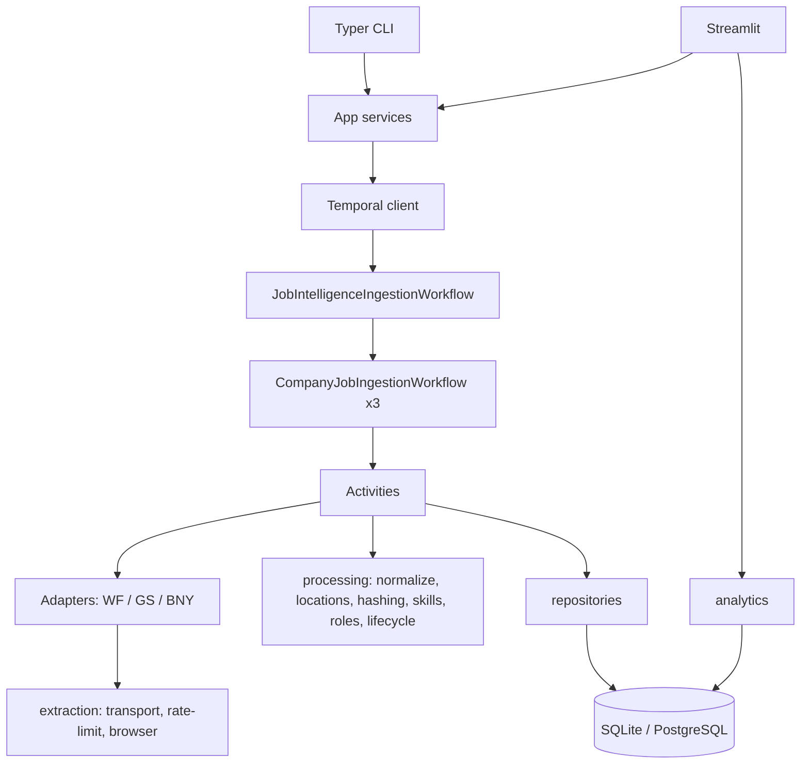
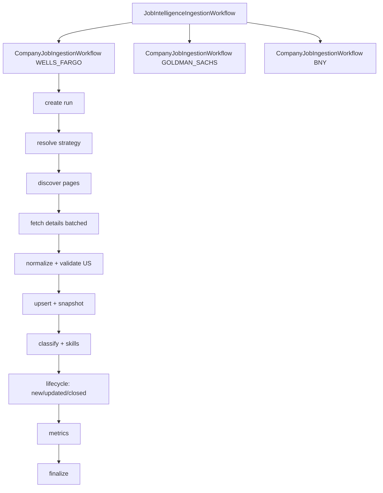
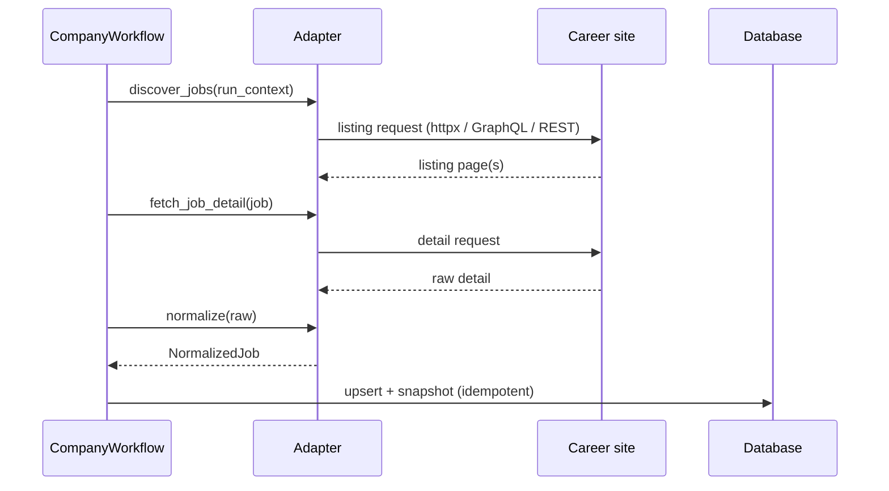
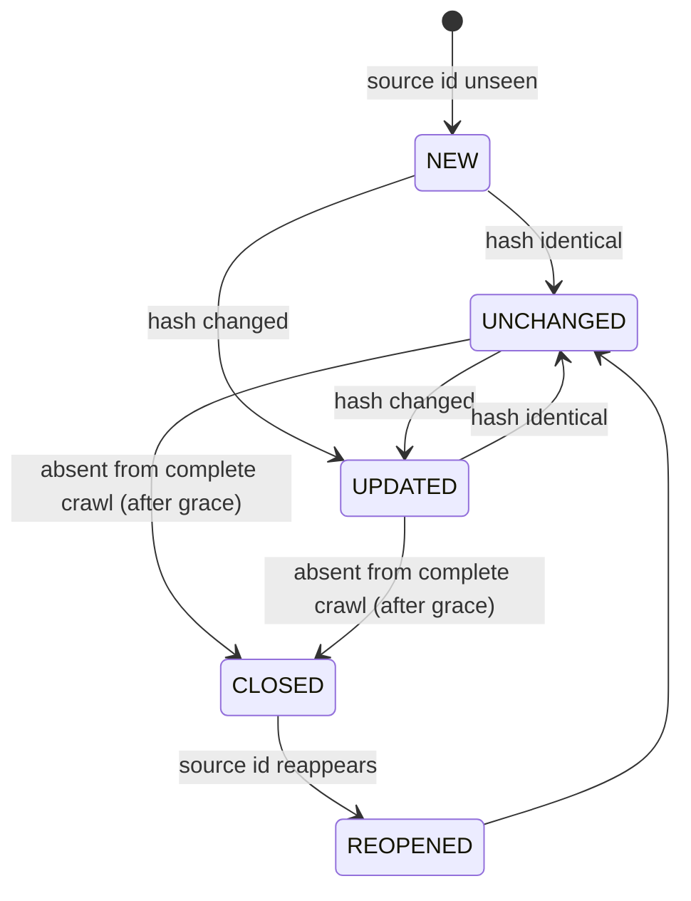
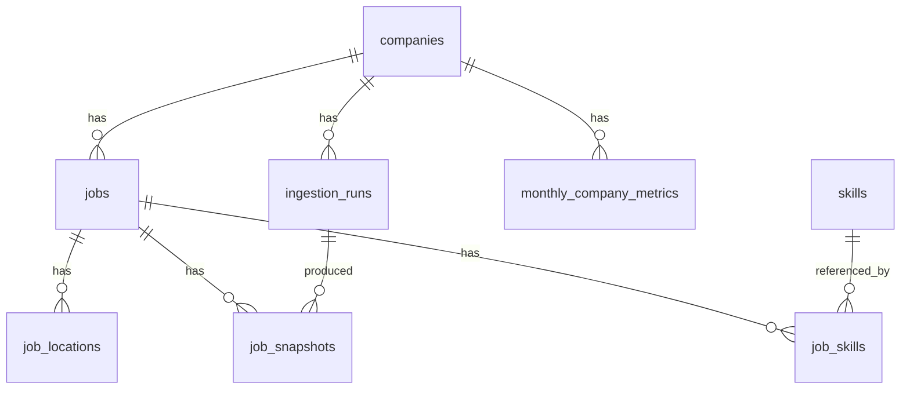

# Architecture

## Milestone status
- [x] **M1** — repo, config, logging, DB schema + Alembic, domain models, Docker Temporal, README skeleton
- [x] **M2** — Playwright reconnaissance utility + three site reports (evidence-based)
- [ ] **M3** — first vertical slice (Wells Fargo → Temporal → SQLite → analytics → one Streamlit page)
- [ ] **M4** — BNY + Goldman Sachs adapters
- [ ] **M5** — Temporal workflows / activities / worker / schedule
- [ ] **M6** — lifecycle, skills, role classification, analytics, summaries
- [ ] **M7** — Streamlit pages, synthetic demo history, CSV exports
- [ ] **M8** — lint/type/test, README verification, limitations & roadmap

## Principles
Adapters are source-specific; domain models are source-independent; workflows
orchestrate deterministically; **Activities perform all side effects** (network,
DB, Playwright, filesystem); repositories own DB access; analytics query
normalized data; the UI never scrapes directly; runs are idempotent; partial
failure is visible; external models are optional; historical facts are never
overwritten; every reported metric has a defined query.

## Component architecture

## Temporal workflow

## Ingestion sequence

## Job lifecycle

## Data model

## Extraction strategy (verified 2026-07-20)
| Company | Method | Endpoint | Pagination | Stable id |
|---|---|---|---|---|
| Wells Fargo | Direct HTTP (server HTML + XML feed) | `/en/jobs/xml/`, `/en/jobs/…` | feed / `pg=` | `R-######` |
| Goldman Sachs | Direct HTTP GraphQL | `api-higher.gs.com/gateway/api/v1/graphql` (`GetRoles`) | `page.pageNumber` (0-idx) | `roleId` |
| BNY | Direct HTTP REST (Oracle CE) | `…/recruitingCEJobRequisitions` | `limit`/`offset` | `Id` |
